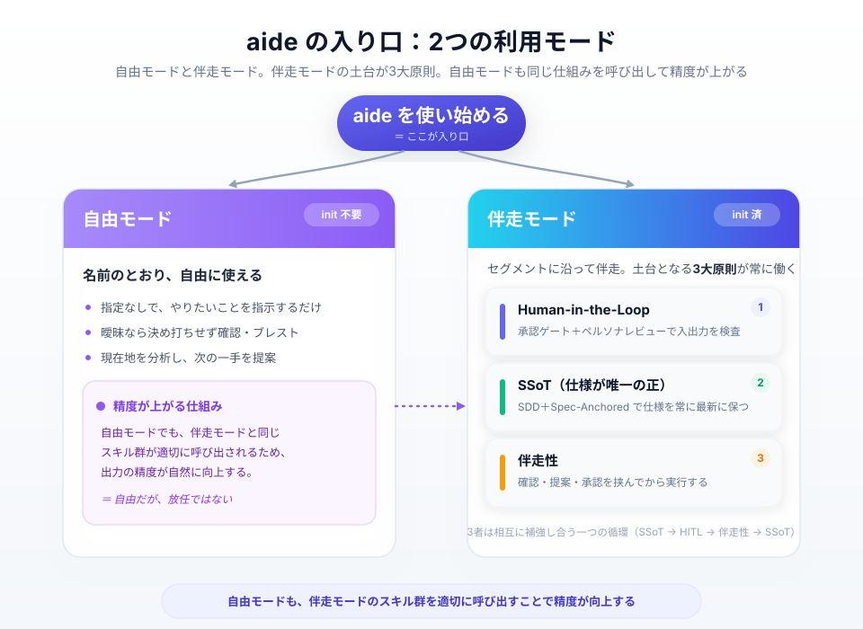
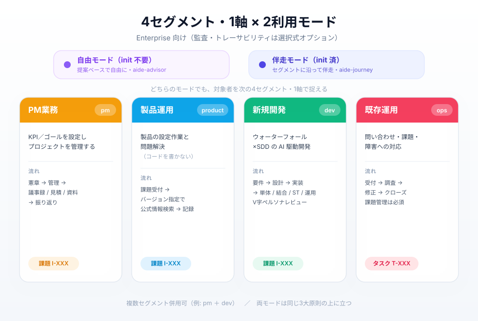
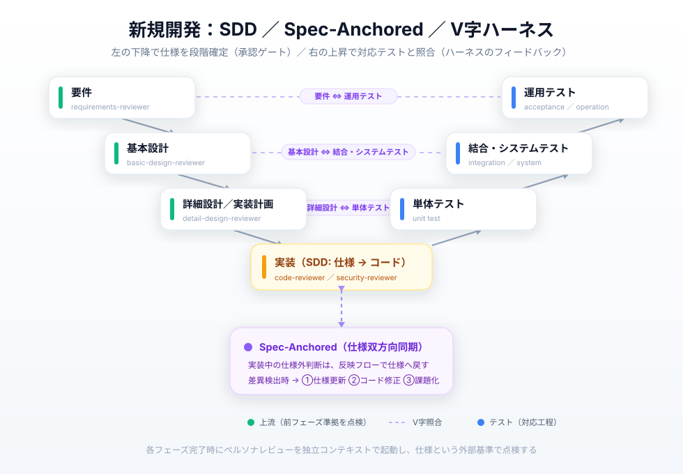

# aide — AI Driven for Enterprise

日本語 | **[English](README.en.md)**

> **AIに任せきりにしない。人がAIを乗りこなし、仕様を共通言語として要件定義から運用まで伴走する エンタープライズ・フレームワーク**

IDE/コンソールを扱える層（PM・製品運用者・新規開発者・既存運用者）が、AIと伴走して業務を進めるためのフレームワーク。何も指定しなくても伴走提案が働く「自由モード」と、対象者別に伴走する「伴走モード」を備える。

| | |
|---|---|
| **開発手法** | 仕様駆動開発（SDD） + Spec-Anchored（仕様双方向同期） + ハーネスエンジニアリング（V字レビュー） |
| **対応AIツール** | Claude Code / GitHub Copilot / Codex |
| **対象セグメント** | PM業務 / 製品運用 / 新規開発 / 既存運用（4区分・1軸） |
| **位置づけ** | Enterprise 向け（監査・トレーサビリティは選択式オプション） |
| **対応環境** | WSL2 / macOS / Linux / **Windows 11・PowerShell（WSL2不要）** |

---

## aideとは

AIに任せきりにしない。人間が判断し、仕様を正として段階的に進める。

- **自由モード（init不要）**: 曖昧な指示は決め打ちせず一度ブレスト提案、作業フォルダ未設定なら確認、意図が固まれば適切なスキルを提案し承認を得て実行（いきなり実行しない）（`aide-advisor`）
- **伴走モード（init済）**: セグメントに沿った伴走タスクを生成し、先走り/出戻りを検知（`aide-journey`）。選んだフェーズだけ浅いフォルダを生成（勝手に作らない・作業フォルダ外に出さない）

```
aide-init          → セグメント・作業フォルダ・フェーズ・成果物を選択式で初期化
aide-advisor      → 現在地を分析し適切なスキルを提案・承認を得て実行（迷ったら叩く相談役）
aide-pm-*          → PM業務（憲章/KPI・管理・議事録・見積・資料・振り返り）
aide-product-*        → 製品運用（バージョン指定の問題解決・課題/設定記録）
aide-dev-*         → 新規開発（仕様・実装・テスト・移行）+ V字ペルソナレビュー
aide-ops-*         → 既存運用（問い合わせ/課題/障害 → 調査 → 修正 → クローズ）
aide-review        → ペルソナ別レビューエージェントを起動
```

---

## 基本原則

**3大原則:**

| 原則 | 説明 |
|---|---|
| **Human-in-the-Loop** | ハーネスエンジニアリングの大原則。AIへのフィードフォワード（インプットの精度）とフィードバック（アウトプットの仕様照合）を人間が検査。実装前の承認ゲートと完了時のペルソナレビューで体現 |
| **SSoT** | SDD と Spec-Anchored で仕様書を常に最新化し、人もAIもドキュメントを正として対話・判断 |
| **伴走性** | 指定がなくても確認/ブレストを挟み、意図が固まれば適切なスキルを提案し承認を得て実行 |

SSoT が HITL のフィードフォワードを支え、HITL のフィードバックが SSoT を最新化し、伴走性が循環を日々の対話に接続する。



> aide の入り口は「自由モード」と「伴走モード」。伴走モードの土台が3大原則で、自由モードも同じスキル群を適切に呼び出して精度が上がる。

**運用作法:** 選択式・オンデマンド生成／浅い階層・中身は自由／勝手に作らない・作業フォルダ外に出さない／インデックス駆動の読み込み

---

## セグメント（4区分・1軸）

| セグメント | 識別子 | 主目的 |
|---|---|---|
| **PM業務** | `pm` | KPI/ゴール設定・プロジェクト管理 |
| **製品運用** | `product` | 製品の設定作業・問題解決（コードを書かない運用） |
| **新規開発** | `dev` | ウォーターフォール×SDD のAI駆動開発 |
| **既存運用** | `ops` | 問い合わせ・課題・障害対応 |

監査・トレーサビリティは選択式オプションとして ON/OFF する。



---

## クイックスタート

```bash
# 初期化（対話でセグメント・作業フォルダ・フェーズ・成果物を選択）
/aide-init                 # pm / product / dev / ops（複数可）

# あるいは指定なしで指示するだけ（自由モード）
# 例:「この障害ファイルの対応を検討して」→ aide-advisor が適切なopsスキルを提案し承認を得て実行
```

詳しい使い方は [.aide/README.md](.aide/README.md) を参照。

---

## ワークフロー概要

| セグメント | 流れ |
|---|---|
| **PM業務** | 憲章(KPI/ゴール) → スケジュール/課題/メンバ管理 → 振り返り |
| **製品運用** | 課題受付 → バージョン指定で公式情報検索・解決 → 設定作業記録 |
| **新規開発** | 要件 → 基本設計 → 詳細設計/実装計画 → 実装 → 単体 → 結合 → システム → 運用テスト（各完了時にV字ペルソナレビュー） |
| **既存運用** | 受付（問い合わせ/課題/障害） → 調査 → 修正 → クローズ |

新規開発（dev）は V字モデルで各フェーズ完了時にペルソナレビューを行う。



---

## コマンド一覧（27スキル）

### コア共通（8）
| コマンド | 概要（何ができるか） |
|---|---|
| `/aide-init` | セグメントを選んでプロジェクトを初期化できる。作業フォルダの確認、選択式のフォルダ生成、プロファイル作成まで行える |
| `/aide-advisor` | 何をすべきか迷ったとき、現在地を分析して次にやるべきスキルを提案してもらえる。承認すればそのまま実行まで橋渡しできる |
| `/aide-brainstorm` | 対話しながら要件書・設計書などの成果物を作成・更新できる（成果物カタログの雛形に沿う） |
| `/aide-sync` | 会話で決まったことを、反映計画の承認を経てドキュメントへ反映できる |
| `/aide-journey` | 伴走タスクを生成し「今どこ・次に何を」を把握できる。先走り/出戻りを指摘してもらえる |
| `/aide-review` | 対象に応じたペルソナで独立レビューを受けられる（新規開発はV字照合） |
| `/aide-diagram` | フロー・構成・ER・シーケンス等の図を draw.io 互換SVGで生成できる |
| `/aide-export` | 成果物を HTML/PDF/docx/pptx に変換して提出用にできる |

### PM業務（6）
| コマンド | 概要（何ができるか） |
|---|---|
| `/aide-pm-charter` | KPI・ゴール・プロジェクト憲章を作成し、ゴールから逆算できる状態を作れる |
| `/aide-pm-manage` | スケジュール・課題（I-XXX）・メンバ体制を一元管理できる |
| `/aide-pm-meeting` | 打合せメモから議事録を作成し、未決事項を課題として自動起票できる |
| `/aide-pm-estimate` | 作業工数を概算/通常の精度（レンジ明示）で見積もれる |
| `/aide-pm-slide` | スライド/見積書/スケジュール/ディスカッション資料を自動判定で作成できる |
| `/aide-pm-retro` | KPT形式で振り返りができ、過去Tryの実施状況も確認できる |

### 製品運用（2）
| コマンド | 概要（何ができるか） |
|---|---|
| `/aide-product-resolve` | 製品バージョンを指定して公式情報を検索し、根拠つきの解決策・設定手順を得られる |
| `/aide-product-task` | 運用課題の管理（I-XXX）と、再現可能な設定作業記録を残せる |

### 新規開発（5）
| コマンド | 概要（何ができるか） |
|---|---|
| `/aide-dev-spec` | 要件/基本設計/詳細設計/実装計画を、前フェーズ準拠を保ちながら作成できる |
| `/aide-dev-code` | 仕様に基づきコードを作成・修正でき、仕様との差異も同期できる（実装前に承認ゲート） |
| `/aide-dev-testspec` | 単体/結合テスト仕様を分離して作成し、仕様カバレッジを確認できる |
| `/aide-dev-test` | テストを実行し、証跡（ログ/スクショ）を収集してレポートを生成できる |
| `/aide-dev-migrate` | 依存更新・移行を支援でき、CVE脆弱性チェックと破壊的変更分析を行える |

### 既存運用（6）
| コマンド | 概要（何ができるか） |
|---|---|
| `/aide-ops-inquiry` | 問い合わせを受け付けて起票し、格納資料・ソースを読んで回答できる |
| `/aide-ops-issue` | 修正を伴う課題を受け付けて起票・管理できる（規模大なら開発フローへ案内） |
| `/aide-ops-incident` | 障害を受け付けて一次対応を整理し、障害報告書を作成できる |
| `/aide-ops-investigate` | 原因調査・影響分析を行い、調査レポートを作成できる（コードは変更しない） |
| `/aide-ops-fix` | 既存整合を保った最小修正を実装できる（承認ゲート・ソースレビューあり） |
| `/aide-ops-close` | 対応をクローズし、再発防止策まで記録できる |

### レビューペルソナ（`.aide/agents/`・9）
`aide-review` から対象に応じて起動される独立レビュアー。

| ペルソナ | 概要（何を見るか） |
|---|---|
| `requirements-reviewer` | 要件書の網羅性・整合・テスト可能性を点検（V字: ⇔運用テスト） |
| `basic-design-reviewer` | 基本設計の要件準拠を点検（V字: ⇔結合・システムテスト） |
| `detail-design-reviewer` | 詳細設計/実装計画の基本設計準拠を点検（V字: ⇔単体テスト） |
| `code-reviewer` | 実装コードの仕様準拠・品質・可読性を点検 |
| `security-reviewer` | 認証認可・入力検証・機微情報・依存脆弱性を点検 |
| `document-reviewer` | 既存運用ドキュメント・対応記録の正確性・整合・最新性を点検 |
| `source-reviewer` | 既存システム修正の整合・影響範囲・回帰リスクを点検 |
| `pm-reviewer` | KPI/ゴール整合・計画妥当性・課題追跡を点検 |
| `product-setting-reviewer` | 製品設定のバージョン適合・リスク・手順の再現性を点検 |

---

## カスタマイズ（.aide は触らない）

**`.aide/` はフレームワーク核として一切編集しない（不可侵）。** カスタマイズはすべて **`.aide/` の外**で行う。これにより、フレームワークの更新（`.aide/` の差し替え）とプロジェクト固有のカスタマイズが衝突しない。

### 何がカスタマイズできるか × どう指定するか（一覧）

| # | カスタマイズ対象 | 指定先（`.aide` の外） | 指定方法 | 反映方式 | コア（不可侵） |
|---|---|---|---|---|---|
| 1 | **Rules**（プロジェクト固有ルール） | `CLAUDE.md` / `AGENTS.md` | ファイルに直接追記 | 上書き＝追記（共通ルールに上乗せ） | `.aide/rules.md` |
| 2 | **成果物カタログ**（どのフェーズで何を作るか） | `.aide-templates/deliverables-catalog.md` | 正本を下敷きに同名ファイルを置く | **上書き**（案件側を優先） | `.aide/templates/deliverables-catalog.md` |
| 3 | **章立て雛形**（成果物の構成） | `.aide-templates/deliverables/<name>.md` | 正本を下敷きに同名ファイルを置く | **上書き**（ファイル単位で丸ごと差し替え） | `.aide/templates/deliverables/<name>.md` |
| 4 | **Export HTML**（見積/スケジュール/ディスカッション/汎用doc） | `.aide-templates/export/<対象物>/<file>` | 正本と同じ相対パスに同名ファイルを置く | **上書き**（同名を優先） | `.aide/templates/export/<対象物>/` |
| 5 | **スライドテーマ**（配色・ロゴ・作図ルール） | `.aide-templates/export/slide/themes/<name>/` | テーマ名フォルダを足す | **追加（和集合）**／同名のときだけ上書き | `.aide/templates/export/slide/themes/` |
| 6 | **独自スキル** | `.claude/skills/<name>/` ・ `.agents/skills/<name>/` | 新規スキルを直接作成 | 追加（sync は消さない・触らない） | `.aide/skills/` |
| 7 | **独自レビューエージェント** | `.claude/agents/<name>.md` | 新規エージェントを直接作成 | 追加（sync は消さない・触らない） | `.aide/agents/` |
| 8 | **案件の既定スライドテーマ** | `CLAUDE.md` の aideプロファイル | `スライドテーマ: <name>` 行を書く | プロファイル参照（個別 frontmatter が優先） | — |

> **上書き と 追加 の違い**
> - **上書き**（2・3・4）= 正本と**同名**のファイルを案件側に置くと、スキルが実行時に案件側を**先に読む**（正本は読まれない）。差し替え型。
> - **追加（和集合）**（5）= 正本のテーマを残したまま**選択肢が増える**。同名フォルダのときだけ案件側が優先される。
> - Templates 系（2〜5）は **`sync` 不要・即反映**。スキルが実行時に `.aide-templates/` → `.aide/templates/` の順で読むため。

> **指定できないもの（意図的な制約）**
> - **既存 `aide-*` スキル／レビューペルソナの「挙動上書き」は非対応**。フレームワーク提供物はそのまま使い、挙動を変えたい場合は**別名で独自追加**する（6・7）。
> - 共通ルール `.aide/rules.md` の直接編集は不可。プロジェクト固有は `CLAUDE.md` / `AGENTS.md` へ（1）。

### Rules（プロジェクト固有ルール）

- 共通ルール `.aide/rules.md` は**編集しない**。プロジェクト固有のルール・方針は `CLAUDE.md`（Claude Code）/ `AGENTS.md`（Copilot・Codex）に直接記述する
- `aide-init` を実行すると、`CLAUDE.md` がプロジェクト固有設定（`@.aide/rules.md` 参照 ＋ aideプロファイル）に置き換わる。プロファイル（セグメント・作業フォルダ・有効フェーズ等）もここで管理する

**指定例**（`CLAUDE.md`）:

```markdown
@.aide/rules.md

## aideプロファイル
- セグメント: dev
- 作業フォルダ: docs/
- スライドテーマ: corporate     # 案件の既定テーマ（#8）

## プロジェクト固有ルール
- コミットメッセージは日本語で書く
- 設計書の章番号を必ずコミットに紐づける
```

### Skills / レビューエージェント

- 独自スキルは `.claude/skills/`（Claude Code）・必要なら `.agents/skills/`（Copilot・Codex）に**直接作成**する。複数ツールで使う場合は各系統に置く
- 独自レビューエージェントは `.claude/agents/` に直接作成する
- sync は aide 管理外のスキル・エージェントを**消さない・上書きしない**ため共存できる（`sync` 不要）
- **既存 `aide-*` スキル／レビューペルソナの「上書き（挙動変更）」は非対応**。フレームワーク提供物としてそのまま使い、挙動を変えたい場合は**別名の独自スキル／エージェントを追加**する

**指定例**（独自スキルを追加）:

```
.claude/skills/my-release-note/SKILL.md   # 独自スキル（別名で追加）
.claude/agents/my-api-reviewer.md         # 独自レビューエージェント
```

### Templates（成果物テンプレート）

- カタログ・章立て雛形の上書きは、プロジェクト直下 **`.aide-templates/`**（`.aide/` の外）に置く
  - `.aide-templates/deliverables-catalog.md` … カタログ上書き（#2）
  - `.aide-templates/deliverables/<name>.md` … 章立て雛形上書き（#3）
- スキル（`aide-init` / `aide-brainstorm` / `aide-dev-spec` / `aide-pm-charter` 等）は実行時に **`.aide-templates/` を優先**し、無ければ `.aide/templates/` を読む
- 正本 `.aide/templates/` は編集しない。スキルが実行時に直接読むため**即反映**（`sync` 不要）
- `aide-init` の「標準メニューを調整しますか？」に Yes で、正本を下敷きにした `.aide-templates/` を**自動生成**できる（手作業不要）
- 章立て雛形は**ファイル単位で丸ごと差し替え**になる。1章だけ足す場合も正本をコピーして編集するため、`.aide/` 側の雛形更新は案件側の上書きには自動追従しない点に注意

**指定例**（要件書の章立てを案件用に差し替え）:

```
.aide-templates/deliverables/requirements.md   # 正本をコピーして章を追加・編集
```

### Export / スライドテーマ

- 提出用の変換テンプレートは `.aide/templates/export/` を正本に**対象物ごとフォルダ**（`slide/` `document/` `estimate/` `schedule/` `discussion/`）で持つ
- HTML テンプレート等の**単一ファイル**は `.aide-templates/export/<対象物>/<file>` に同名で置くと**上書き**（#4）
- **スライドテーマは「上書き」ではなく「追加」**（#5）。`.aide-templates/export/slide/themes/<name>/` を足すと、正本テーマ（`corporate`・`proposal`）と**和集合**で選択肢に並ぶ
  - **命名規約**: フォルダ名 ＝ CSS 先頭の `/* @theme <name> */` ＝ MD frontmatter の `theme:` 値を**一致**させる（既定 `corporate`）
  - テーマフォルダ構成: `theme.css`（必須）＋任意で `assets/`（画像・ロゴ）・`rules.md`（テーマ固有の作図ルール）
  - 既定配色だけ変えたい場合は、同名 `.aide-templates/export/slide/themes/corporate/theme.css` を置けば案件側が優先される

**指定例**（案件テーマを追加して使う）:

```css
/* .aide-templates/export/slide/themes/acme/theme.css */
/* @theme acme */
:root {
  --color-primary: #16a34a;   /* 案件のブランドカラーに差し替え */
  --color-accent:  #15803d;
}
```

```markdown
---
marp: true
theme: acme        # ← どのテーマを使うかは MD の frontmatter で指定（#5）
---
```

> どのテーマを使うかは MD スライドの frontmatter `theme:` で指定する（Marp 標準キー）。案件の既定テーマは `CLAUDE.md` のプロファイル `スライドテーマ:` 行で指定でき（#8）、MD 側の個別指定があればそちらが優先される。

---

## プロジェクト構成（2系統に集約）

```
.aide/                          ← aide共通フレームワーク（不可侵・一切編集しない）
├── rules.md                    ← 共通ルール（マスター）
├── skills/                     ← スキル正本（27）
├── agents/                     ← レビューエージェント正本（9）
├── templates/
│   ├── deliverables-catalog.md ← 成果物カタログ
│   ├── deliverables/           ← 章立て雛形
│   └── export/                 ← 変換テンプレート（対象物ごとフォルダ）
│       ├── slide/              ←   slide-template.md ＋ themes/<name>/theme.css
│       ├── document/ estimate/ schedule/ discussion/  ← 各 HTML テンプレート
│       └── metadata.yaml / scripts/  ← 共通メタデータ・変換スクリプト
└── scripts/sync-skills.sh / .ps1  ← ラッパー生成（bash / PowerShell）
.aide-templates/                ← ★カスタム: カタログ・雛形・export の上書き／スライドテーマ追加（任意・.aide の外）
CLAUDE.md                       ← Claude Code用 → @.aide/rules.md ＋ aideプロファイル（★Rules カスタム先）
AGENTS.md                       ← GitHub Copilot + Codex 用（★Rules カスタム先）
.claude/skills/ , .claude/agents/  ← 自動生成ラッパー ＋ ★独自スキル/エージェント
.agents/skills/                 ← 自動生成ラッパー ＋ ★独自スキル
```

> ルールファイルは **CLAUDE.md と AGENTS.md の2本**、スキルラッパーは **`.claude/skills/` と `.agents/skills/` の2系統**。Copilot は AGENTS.md + `.agents/skills/` を、Codex も同じく `.agents/` を参照する。

### スキルの保守

```bash
bash .aide/scripts/sync-skills.sh            # POSIX（bash）
pwsh -File .aide/scripts/sync-skills.ps1     # Windows（PowerShell・WSL2不要）
```
正本（`.aide/skills/`・`.aide/agents/`）のみ編集し、ラッパーは sync で再生成する。

---

## 動作環境

| 環境 | 対応 |
|---|---|
| WSL2 / macOS / Linux | 推奨（bash 版 sync） |
| **Windows 11 / PowerShell** | **対応（WSL2不要）** — `sync-skills.ps1`、Python は `python`/`py` |
| Git Bash（Windows） | 対応 |

- **必須**: Git のみ
- **エクスポート/Office読み込み時**: marked / marp-cli / pandoc / ansi2html / python-pptx / openpyxl 等（未導入時に案内、OS別コマンド）

---

## ライセンス

[MIT](LICENSE)
